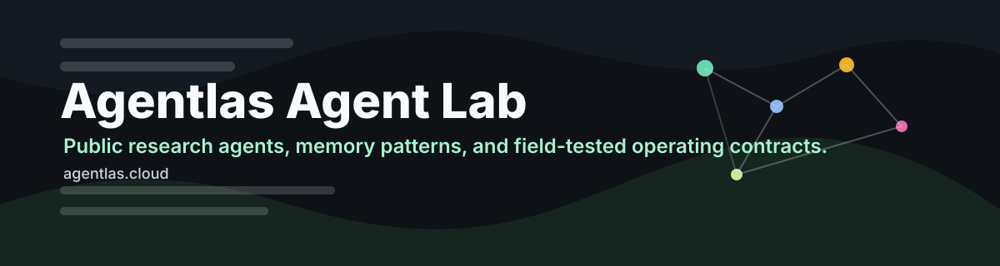
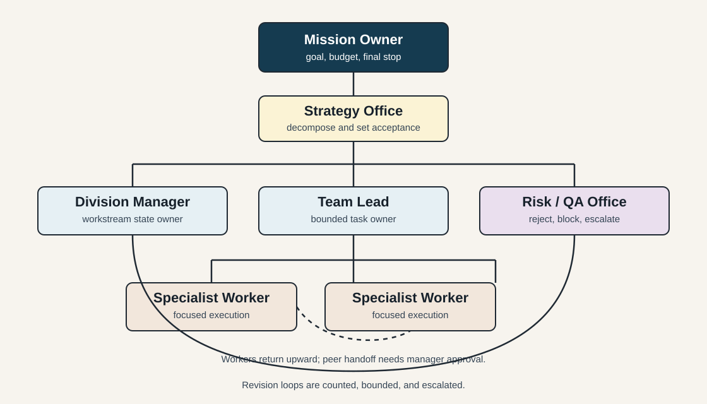

<p align="center">
  
</p>

<h1 align="center">Agentlas Org Chart</h1>

<p align="center">
  <a href="https://agentlas.cloud">agentlas.cloud</a>
  ·
  <a href="https://github.com/jeongmk522-netizen/agentlas_org_chart">agentlas_org_chart</a>
</p>

<p align="center">
  A hierarchy-first coordination protocol for multi-agent systems that need
  fewer loops, clearer ownership, and explicit termination authority.
</p>

<p align="center">
  
</p>

## Abstract

Many multi-agent demos present agents as peers: researcher talks to analyst,
analyst talks to writer, writer hands back to reviewer, and the graph continues
until a routing rule or recursion limit stops it. That is expressive, but it
also creates a common reliability problem: no one clearly owns the outcome.
When every agent can keep asking another peer for more work, the system can
drift into redundant handoffs, circular review, or tool-call loops.

Agentlas Org Chart proposes a different default. It treats an agent network as
an organization chart, not a chat room. A top-level owner frames the mission,
middle managers own bounded workstreams, staff offices enforce policy and
evidence quality, team leads delegate execution, and contributors return
structured evidence rather than starting new side quests. The design is
inspired by familiar enterprise reporting lines, including Korean large-company
org charts, but the claim is architectural rather than cultural: hierarchy
reduces loops when it creates explicit authority, escalation paths, budgets,
and stop conditions.

## Research Question

Can a hierarchy-first agent org chart reduce infinite-loop failure modes in
CrewAI, LangGraph, OpenAI Agents SDK, AutoGen, and similar multi-agent systems
without making the system slow, brittle, or overly centralized?

## Hypothesis

Loop failures are often organization-design failures, not just prompt failures.
The risk rises when a multi-agent system has peer handoffs, shared ambiguous
state, no accountable owner, and weak definitions of done. A vertical org chart
can reduce this risk by assigning:

- One accountable mission owner.
- One owner per workstream.
- A finite delegation depth.
- A finite iteration budget per task.
- A typed return contract for every worker.
- A manager-only authority to reopen, escalate, or terminate work.

## Why This Exists

Frameworks already contain pieces of hierarchy. CrewAI documents sequential and
hierarchical processes, where a manager coordinates and validates worker output.
LangChain and LangGraph document supervisor, subagent, router, handoff, and
custom workflow patterns. OpenAI's Agents SDK supports manager-style
orchestration and handoffs. Anthropic has described an orchestrator-worker
research system in production.

The missing layer is not another framework. The missing layer is an operating
model: who may delegate, who may approve, who may ask for revision, who owns the
final answer, and when the run must stop.

## Org Chart Model

```text
Chair / Mission Owner
  -> Strategy Office
  -> Division Manager
       -> Team Lead
            -> Specialist Worker
       -> QA / Evidence Office
  -> Risk / Policy Office
  -> Final Synthesis Office
```

| Layer | Agent role | Main authority | Loop-control rule |
|---|---|---|---|
| Chair | Mission owner | Defines goal, constraints, and final stop condition. | Only this layer can extend global budget. |
| Strategy Office | Planner | Converts vague request into workstreams and acceptance criteria. | Cannot execute worker tasks directly. |
| Division Manager | Workstream owner | Delegates to team leads, tracks blockers, merges evidence. | Maximum revision count per workstream. |
| Team Lead | Task owner | Assigns one bounded job to one or more specialists. | Must return to manager after each attempt. |
| Specialist Worker | Executor | Performs focused research, code, data, or writing task. | Cannot call peer workers directly. |
| QA / Evidence Office | Verifier | Checks evidence, citations, tests, and contradiction risk. | Can reject once, then escalates. |
| Risk / Policy Office | Guardrail | Reviews privacy, security, cost, and publication risk. | Can block or require human approval. |
| Final Synthesis Office | Editor | Produces final artifact from accepted workstream outputs. | Cannot reopen closed work without manager approval. |

## Design Principles

1. Vertical routing by default: workers report up; lateral handoffs need manager
   approval.
2. Typed returns over conversational drift: every worker returns status,
   evidence, output, blockers, and proposed next action.
3. Explicit done state: each workstream has `done`, `blocked`, `needs_revision`,
   or `escalate`.
4. Budgeted iteration: every level owns a local max-turn, max-cost, and
   max-revision budget.
5. Escalation is a feature: unresolved ambiguity moves upward instead of
   bouncing sideways.
6. Memory follows authority: durable memory lives at owner and manager layers;
   specialists receive only scoped context.
7. QA is separate from execution: verifiers can reject work, but they cannot
   recursively create unbounded new work.

## Framework Mapping

| Framework | Native concept | Org Chart interpretation |
|---|---|---|
| CrewAI | Sequential and hierarchical process | Use hierarchical mode as the baseline; manager agent owns delegation and validation. |
| LangGraph | Supervisor, subagents, routers, custom workflows | Model each management layer as a node/subgraph with explicit end edges and recursion budgets. |
| OpenAI Agents SDK | Agents as tools, handoffs, manager orchestration | Use manager-style orchestration for ownership; reserve peer handoffs for user-facing specialist takeover. |
| AutoGen | GroupChatManager | Treat the manager as a formal reporting line, not just a moderator for an open group chat. |

## Loop Failure Modes

| Failure mode | Flat-network symptom | Org Chart guard |
|---|---|---|
| Peer ping-pong | Agent A asks B, B asks A, no owner closes. | Workers cannot call peers directly. |
| Reviewer recursion | Reviewer keeps asking for more polish without limit. | QA gets one reject path, then escalation. |
| Research sprawl | Research worker opens more subtopics indefinitely. | Team lead scopes source count and timebox. |
| Tool spiral | Agent retries same tool after weak result. | Worker must declare `blocked` after retry budget. |
| State ambiguity | Agents disagree on current truth. | Manager owns canonical workstream state. |
| Approval fog | Everyone suggests, nobody decides. | Chair or division manager owns final call. |

## Repository Map

- [agent.md](agent.md): usable Agentlas Org Chart agent contract.
- [docs/org-chart-model.md](docs/org-chart-model.md): full hierarchy model and runtime rules.
- [docs/framework-notes.md](docs/framework-notes.md): source-backed notes on CrewAI, LangGraph, OpenAI Agents SDK, Anthropic, and AutoGen.
- [docs/evaluation.md](docs/evaluation.md): experiments and metrics for loop reduction.
- [docs/research-log.md](docs/research-log.md): dated research notes.
- [templates/org-chart-contract.md](templates/org-chart-contract.md): copyable org chart template for a project.
- [memory.md](memory.md): public memory for this research repo.

## Sources

- CrewAI: [Hierarchical Process](https://docs.crewai.com/en/learn/hierarchical-process), [Processes](https://docs.crewai.com/en/concepts/processes)
- LangChain/LangGraph: [Multi-agent](https://docs.langchain.com/oss/python/langchain/multi-agent/index), [Subagents](https://docs.langchain.com/oss/python/langchain/multi-agent/subagents), [LangGraph overview](https://docs.langchain.com/oss/python/langgraph), [GRAPH_RECURSION_LIMIT](https://docs.langchain.com/oss/python/langgraph/GRAPH_RECURSION_LIMIT)
- OpenAI Agents SDK: [Agent orchestration](https://openai.github.io/openai-agents-python/multi_agent/), [Handoffs](https://openai.github.io/openai-agents-js/guides/handoffs/)
- Anthropic Engineering: [How we built our multi-agent research system](https://www.anthropic.com/engineering/multi-agent-research-system)
- AutoGen: [GroupChat reference](https://autogenhub.github.io/autogen/docs/reference/agentchat/groupchat/)
